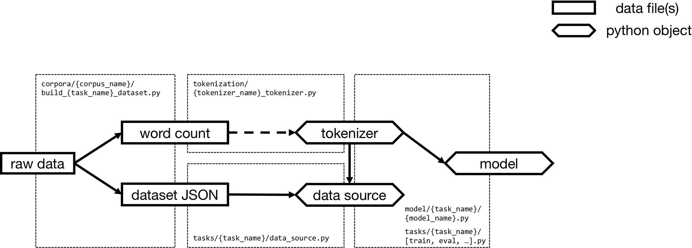
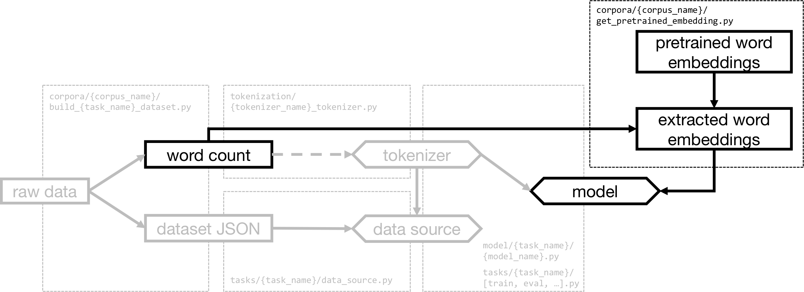

# Dialog Processing

This repository provides a general architecture for NLU and NLG in dialog modeling. The main idea is to design 1) a general data structure for easier access to different corpora and 2) general APIs for experimenting with different models and corpora with minimum efforts.

| Section |
|-|
| [Run a task by commands](#example-commands-to-run-a-task) |
| [Components](#components) |
| [How to add new things](#how-to-add-new-corpus/task/model/tokenizer) |
| [What are supported now](#what-are-supported-now) |

## Example commands to run a task

(at directory dialog_processing/src/)

~~~~
# 1. download raw data and preprocess
python -m corpora.{corpus_name}.build_{task_name}_dataset

# 2. extract pretrained word embeddings (optional if you are not gonna use pretrained embeddings) 
# 2.1 download pretrained word embeddings to be used (e.g. Glove, word2vec, ...)
# 2.2 extract needed word embeddings from raw file
python -m corpora.{corpus_name}.get_pretrained_embedding -t {task_name} -e {pretrained_embedding_type} -p {path_to_pretrained_embedding} -o {path_to_output_json_file}

# 3. train a model
python -m tasks.{task_name}.train --model {model_name} --corpus {corpus_name} --tokenizer {tokenizer_name} --enable_log True --save_model True [--{arg} {value}]*

# 4. evaluate a trained model
python -m tasks.{task_name}.eval --model {model_name} --corpus {corpus_name} --tokenizer {tokenizer_name} --model_path {path_to_the_trained_model} [--{arg} {value}]*
~~~~

The scripts also accept other arguments (see the code for details).

## Components

### Standardized dataset JSON file

(related code: `corpora/{corpus_name}/build_{task_name}_dataset.py`)

Raw dialog corpora may have very different data structures, so we convert raw data into a general dataset JSON file.

A dataset JSON file can be seen as a dictionary that stores data for training, development, and test.

~~~~
dataset_json = {
    "train": [a list of dialog sessions for training],
    "dev": [a list of dialog sessions for validation],
    "test": [a list of dialog sessions for test]
}
~~~~

A dialog session is also a dictionary, in which `"dialog_meta"` contains meta information of this session. The meta information available depends on the corpus used and what is needed in your task and model. For example in Cornell Movie Corpus, we can store `"character1ID"` and `"character2ID"` in `"dialog_meta"`.

~~~~
dialog_session = {
    "utterances": [a list of utterances],
    "dialog_meta": {
        key1: value1,
        key2: value2,
        ...
    }
}
~~~~

An utterance is a dictionary with two basic information `"floor"` and `"text"`. There is also a dictionary of `"utterance_meta"` that stores information such as `"dialog_act"` and `"characterID"`.

~~~~
utterance = {
    "floor": "A" or "B" (currently I only focus on two-party dialogs), 
    "text": a str,
    "utterance_meta": {
        key1: value1,
        key2: value2,
        ...
    } 
}
~~~~

A by-product of this process is a word count file, which is a vocabulary built from the training data along with word counts. The vocabulary can be used for 1) constructing a whitespace-based tokenizer and 2) extracting needed word embeddings from pretrained word embeddings. It may also be needed in 3) the calculation of some evaluation metrics that requires word frequency information.

### Tokenizer

(related code: `tokenization/{tokenizer_name}_tokenizer.py`)

A tokenizer bridges 1) the gap between human language (sentence) and model inputs (word ids) and 2) the gap between model outputs (word ids) and human language (sentence). Therefore, it should provide following basic functions.

* convert a sentence string into a list of tokens
`convert_string_to_tokens()`
* convert a list tokens into a list of word ids
`convert_tokens_to_ids()`
* convert a list word ids into a list tokens
`convert_ids_to_tokens()`
* convert a list of tokens into a sentence string
`convert_tokens_to_string()`

To ensure the consistency in these processes and reverse processes, a tokenizer internally maintains a `word2id` dictionary and an `id2word` dictionary. These dictionaries should also correspond to the word embedding lookup-table of a model, so `tokenizer` is also taken as a parameter when initializing a model.

### Data source

(related code: `tasks/{task_name}/data_source.py`)

Usually we train/evaluate models using mini batches. A data source reads in dataset JSON and produces mini batches of model inputs. 

### Model

(related code: `model/{task_name}/{model_name}.py`)

A model usually should provide three main APIs, i.e. `train_step()`, `evaluate_step()`, and `test_step()`. The APIs perform a training/dev/test step on a mini batch respectively.

### Pretrained word embeddings (optional)

(related code: `corpora/{corpus_name}/get_pretrained_embedding.py`)

Though various pretrained word embeddings (e.g. Glove, word2vec, etc.) are available, they have different formats and may contain words that are not included in our vocabulary. Therefore, we use a script to convert them into a JSON file and only keep those words that appear in our vocabulary. (The vocabulary refers to the word count file generated in the process of "raw data -> dataset JSON".)

## How to add new corpus/task/model/tokenizer

### Add new corpus (for a task)

To add a new corpus named `{corpus_name}` for a task `{task_name}`, save your configurations (such as filepaths) in `corpora/{corpus_name}/config.py`, then write a data processing script and save as `corpora/{corpus_name}/build_{task_name}_dataset.py`. The script is supposed to download/process raw corpus data and output a standardized dataset json file (see [Standardized dataset JSON file](#standardized-dataset-json-file)).

### Add a task for an existing corpus

First, modify/add data-related code as same as above. Notice that the same dataset json file can be used for different tasks (e.g. response generation and dialog act recognition) as long as their information can be stored in the same data structure. 

Then, you need to write scripts to train/evaluate/etc models on this task as well as a task-specific data source. These scripts should be placed in the folder `tasks/{task_name}`. 

### Add a model for a task

Models directly used by a certain task are placed in `model/{task_name}`. When writing a new model, you should provide APIs to be used in scripts mentioned above (such as `train_step()`, `evaluate_step()`, etc.). Using module blocks from `model/modules/` will make the procedure easier.

### Add a tokenizer

A new tokenizer should be added in `tokenization/`. Be sure to provide the same APIs (those functions with name `convert_*`) as other tokenizers since they are used in task scripts and data sources.

## What are supported now

### Corpora

- DailyDialog (`dd`)
- PersonaChat (`personachat`)
- CornellMovie (`cornellmovie`)
- Switchboard Dialog Act (SwDA, `swda`)

### Tasks

- dialog response generation (`response_gen`)
- dialog response evaluation (`response_eval`) (to be released)
- dialog act recognition (`da_recog`)
- language modeling (`lm`)

### Models

- dialog response generation
  - seq2seq (`S2S`)
  - HRED (`HRED`, Serban 2016, [arxiv](https://arxiv.org/abs/1507.04808))
  - HRED with relative speaker utterance encoders (`HREDSepUttrEnc`, Zhao 2019, [arxiv](https://arxiv.org/abs/1907.05599))
  - VHRED (`VHRED`, Serban 2017, [arxiv](https://arxiv.org/abs/1605.06069))
  - VHCR (`VHCR`, Park 2018, [arxiv](https://arxiv.org/abs/1804.03424))
  - GPT2 for response generation (`GPT2`, Wolf 2019, [arxiv](https://arxiv.org/abs/1901.08149))
- dialog response evaluation
  - ADEM (`ADEM`, Lowe 2017, [arxiv](https://arxiv.org/abs/1708.07149))
  - RUBER (`RUBER`, Tao 2018, [arxiv](https://arxiv.org/abs/1701.03079))
  - Roberta-eval (`Roberta`, Zhao 2020, [arxiv](#))
- dialog act recognition
  - HRE (`HRE`)
  - HRE with relative speaker utterance encoders (`HRESepUttrEnc`, Zhao 2019, [arxiv](https://arxiv.org/abs/1907.05599))
  - Roberta (`Roberta`, Liu 2019, [arxiv](https://arxiv.org/abs/1907.11692))
- language modeling
  - RNNLM (`RNNLM`)

### Tokenizers

- Whitespace-based tokenizer (`BasicTokenizer`)
- BERT tokenizer (`ModBertTokenizer`)
- GPT2 tokenizer (`ModGPT2Tokenizer`)
- Roberta tokenizer (`ModRobertaTokenizer`)

### Metrics
(in `utils/metrics.py`)

Sentence comparison (a hypothesis against a reference):
  - BLEU-n
  - multi-ref BLEU-n
  - embedding-based similarity
    - extrema vector
    - greedy matching
    - average vector
    - multi-ref extrema vector
    - multi-ref greedy matching
    - multi-ref average vector
    - SIF embedding (Arora 2017, [arxiv](https://openreview.net/forum?id=SyK00v5xx); used in Zhao 2019, [arxiv](https://arxiv.org/abs/1907.05599))
  - Distinct-\[1,2\]

Classification:
  - F1 scores
  - precision scores
  - recall scores

